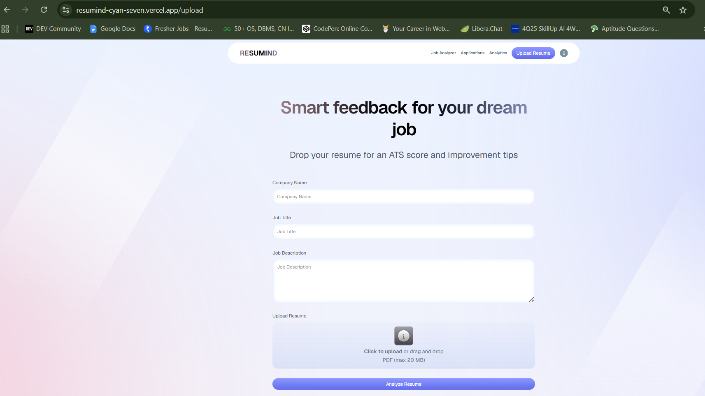
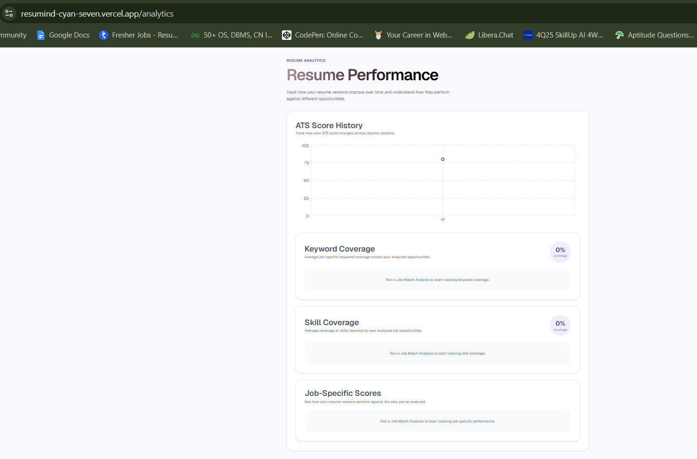

# Resumind

<div align="center">

### AI-Powered Career Optimization Platform

Analyze your resume, match it against jobs, improve it with AI, manage applications, and track your career progress — all in one place.

<br />

<a href="https://resumind-cyan-seven.vercel.app/">
  
</a>
&nbsp;
<a href="https://github.com/shrutikotgire0129/resumind">
  
</a>

</div>

---

## Overview

**Resumind** is an AI-powered career optimization platform designed to help job seekers improve their resumes, evaluate their fit for specific roles, manage job applications, and understand their career-search performance.

Instead of providing only a resume score, Resumind brings multiple stages of the job-search workflow into one application:

**Analyze → Match → Improve → Apply → Track → Measure**

The platform uses AI to analyze resume content, evaluate ATS compatibility, compare resumes against job descriptions, identify skill and keyword gaps, and provide actionable improvement suggestions.

---

## Live Demo

<div align="center">

### [Visit Resumind →](https://resumind-cyan-seven.vercel.app/)

</div>

---

## Key Features

### Resume Analysis

Upload a resume and receive an AI-powered evaluation covering:

* Overall resume score
* ATS compatibility
* Tone and style
* Resume content
* Structure
* Skills
* Actionable improvement suggestions

---

### Resume Versioning

Maintain multiple versions of a resume for different roles.

* Create new resume versions
* Track version numbers
* Associate versions with specific job applications
* Analyze how different resume versions perform
* Preserve version-specific job matching history

This makes it possible to tailor resumes for different companies without losing previous versions.

---

### Job Description Analyzer

Compare a resume against a target job description using AI.

The analyzer identifies:

* Overall job match score
* Matching skills
* Missing skills
* Matching keywords
* Missing keywords
* Experience compatibility
* ATS compatibility
* Actionable recommendations

Each analysis is stored with the resume version that was used.

---

### AI Resume Improvement Assistant

Improve individual resume sections using AI.

Supported sections include:

* Professional Summary
* Experience
* Projects
* Skills
* Education
* Custom sections

The assistant can:

* Extract the selected section directly from the uploaded resume
* Improve the content using AI
* Optimize wording for ATS compatibility
* Preserve the candidate's original facts
* Explain why the revised version is stronger
* Show the changes made
* Copy the improved content

The goal is not to invent experience, but to improve how existing experience is communicated.

---

### Job Application Tracker

Manage the complete job-search pipeline from one dashboard.

Supported application statuses:

* Wishlist
* Applied
* OA / Assessment
* Interview
* Offer
* Rejected

Applications can include:

* Company
* Job title
* Applied date
* Job URL
* Resume version used
* Notes
* Recruiter name
* Recruiter email
* Recruiter LinkedIn
* Follow-up date
* Priority
* Job type
* Tags
* Interview details
* Status history

Additional functionality includes:

* Search
* Filtering
* Sorting
* Pagination
* Edit and delete
* CSV export
* Follow-up status indicators
* Application status timeline

---

### Resume Analytics

Understand resume and job-search performance through visual analytics.

#### ATS Score History

Track ATS scores across resume versions.

#### Keyword Coverage

Measure how effectively resume versions match keywords identified from analyzed job descriptions.

#### Skill Coverage

Compare matching and missing skills across job analyses.

#### Job-Specific Scores

Review historical match scores for individual job opportunities and resume versions.

---

### Application Insights

The application tracker also provides high-level job-search metrics including:

* Active applications
* Interview rate
* Offer rate
* Rejection rate
* Application status distribution

This provides a quick overview of the current job-search pipeline.

---

## Screenshots

### Dashboard


### Resume Upload



### Job Analyzer


### Job Application Tracker


### Resume Analytics



---

## Tech Stack

### Frontend

* **React 19**
* **TypeScript**
* **React Router**
* **Vite**
* **Tailwind CSS**
* **shadcn/ui**
* **Lucide React**
* **Recharts**

### Authentication

* **Clerk**

### AI

* **Google Gemini API**

Gemini is used for:

* Resume analysis
* Job matching
* Resume section extraction
* AI-powered resume improvement

### File Storage

* **Cloudinary**

Used for resume PDF and image storage.

### Client-Side Data

* **IndexedDB**

Used for persistent local storage of:

* Resumes
* Resume versions
* Job match history
* Job applications
* Application status history

### Development

* **Git**
* **GitHub**
* **ESLint**
* **TypeScript**
* **npm**

---

## Architecture

Resumind follows a modular React Router application structure with dedicated routes for the major career workflows.

```text
Resumind
│
├── Authentication
│   └── Clerk
│
├── Resume Management
│   ├── Upload
│   ├── AI Analysis
│   ├── Resume Versions
│   └── Resume Details
│
├── Job Intelligence
│   ├── Job Description Analyzer
│   ├── Skill Matching
│   ├── Keyword Matching
│   └── ATS Compatibility
│
├── AI Resume Assistant
│   ├── Section Extraction
│   ├── AI Improvement
│   ├── Improvement Explanation
│   └── Change Detection
│
├── Application Management
│   ├── Applications
│   ├── Status Tracking
│   ├── Recruiter Details
│   ├── Follow-ups
│   ├── Priorities
│   ├── Tags
│   └── CSV Export
│
└── Analytics
    ├── ATS Score History
    ├── Keyword Coverage
    ├── Skill Coverage
    └── Job-Specific Scores
```

---

## Data Flow

A typical resume optimization workflow looks like this:

```text
                ┌─────────────────┐
                │   Upload Resume │
                └────────┬────────┘
                         │
                         ▼
                ┌─────────────────┐
                │ Cloudinary      │
                │ PDF Storage     │
                └────────┬────────┘
                         │
                         ▼
                ┌─────────────────┐
                │ Gemini AI       │
                │ Resume Analysis │
                └────────┬────────┘
                         │
                         ▼
                ┌─────────────────┐
                │ Resume Version  │
                └────────┬────────┘
                         │
             ┌───────────┴───────────┐
             ▼                       ▼
   ┌─────────────────┐     ┌─────────────────┐
   │ Job Description │     │ AI Improvement  │
   │ Analyzer        │     │ Assistant       │
   └────────┬────────┘     └────────┬────────┘
            │                       │
            └───────────┬───────────┘
                        ▼
               ┌──────────────────┐
               │ Application      │
               │ Tracker          │
               └────────┬─────────┘
                        │
                        ▼
               ┌──────────────────┐
               │ Career Analytics │
               └──────────────────┘
```

---

## Project Structure

```text
resumind/
├── app/
│   ├── components/
│   │   ├── ui/
│   │   ├── Navbar.tsx
│   │   ├── ResumeCard.tsx
│   │   └── ResumeImprovement.tsx
│   │
│   ├── lib/
│   │   ├── cloudinary.ts
│   │   ├── resume-db.ts
│   │   └── utils.ts
│   │
│   ├── routes/
│   │   ├── api.job-match.ts
│   │   ├── api.resume-analysis.ts
│   │   ├── api.resume-extract.ts
│   │   ├── api.resume-improve.ts
│   │   ├── analytics.tsx
│   │   ├── applications.tsx
│   │   ├── auth.tsx
│   │   ├── home.tsx
│   │   ├── job-analyzer.tsx
│   │   ├── resume.tsx
│   │   ├── upload.tsx
│   │   └── wipe.tsx
│   │
│   ├── root.tsx
│   └── routes.ts
│
├── constants/
├── public/
├── types/
├── screenshots/
├── components.json
├── package.json
├── react-router.config.ts
├── vite.config.ts
└── README.md
```

---

## Getting Started

### Prerequisites

Make sure you have installed:

* Node.js
* npm
* Git

### Clone the Repository

```bash
git clone https://github.com/shrutikotgire0129/resumind.git
cd resumind
```

### Install Dependencies

```bash
npm install
```

### Environment Variables

Create a `.env` file in the project root and configure the required services:

```env
VITE_CLERK_PUBLISHABLE_KEY=your_clerk_publishable_key
CLERK_SECRET_KEY=your_clerk_secret_key

VITE_CLOUDINARY_CLOUD_NAME=your_cloudinary_cloud_name
VITE_CLOUDINARY_UPLOAD_PRESET=your_cloudinary_upload_preset

GEMINI_API_KEY=your_gemini_api_key
```

Never commit real API keys or secret credentials to GitHub.

### Run the Development Server

```bash
npm run dev
```

Open the local development URL shown by Vite in your browser.

### Type Check

```bash
npm run typecheck
```

### Production Build

```bash
npm run build
```

---

## Resume Data & Privacy

Resume files are stored using Cloudinary, while application and resume metadata is persisted locally through IndexedDB.

Because application data is currently stored client-side, data is tied to the browser/device where the application is being used rather than being synchronized across multiple devices.

API keys and server-side credentials should always remain in environment variables and should not be committed to the repository.

---

## Why Resumind?

Most resume tools focus on a single score.

Resumind takes a broader approach by connecting the complete job-search workflow:

```text
Resume Analysis
      ↓
Job Matching
      ↓
Resume Improvement
      ↓
Resume Versioning
      ↓
Job Applications
      ↓
Application Tracking
      ↓
Career Analytics
```

This makes Resumind useful not only for understanding a resume, but also for continuously improving and managing the job-search process.

---

## Engineering Highlights

Resumind demonstrates practical implementation of:

* AI-powered document analysis
* Structured AI responses
* PDF processing
* Cloud file storage
* Authentication and protected routes
* Client-side persistent storage
* Resume version management
* Job-to-resume matching
* AI-assisted content transformation
* CRUD application architecture
* Search, filtering, sorting, and pagination
* Data visualization
* Historical analytics
* Form validation
* Responsive UI
* Type-safe React development
* Modular route architecture

---

## Future Direction

Potential areas for future evolution include:

* Cloud-backed multi-device synchronization
* Automated testing
* CI/CD workflows
* Advanced resume comparison
* More detailed career analytics
* Additional job-search automation

---

## Author

### Shruti Hiraman Kotgire

Software Engineer / SDE Candidate

[](https://github.com/shrutikotgire0129)
[](https://www.linkedin.com/in/shrutikotgire129)

---

## License

This project is intended for portfolio and educational purposes.
